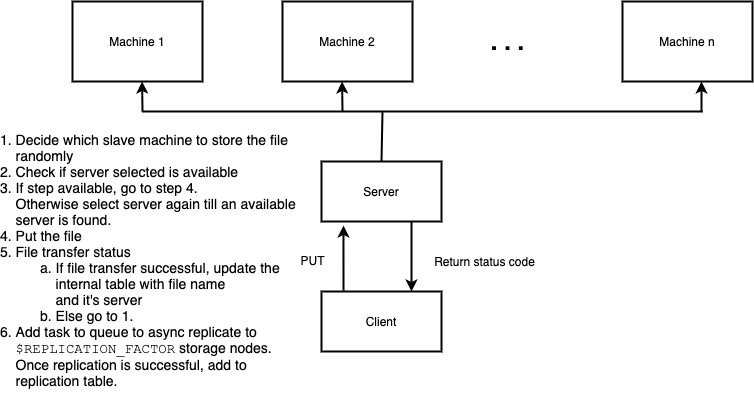
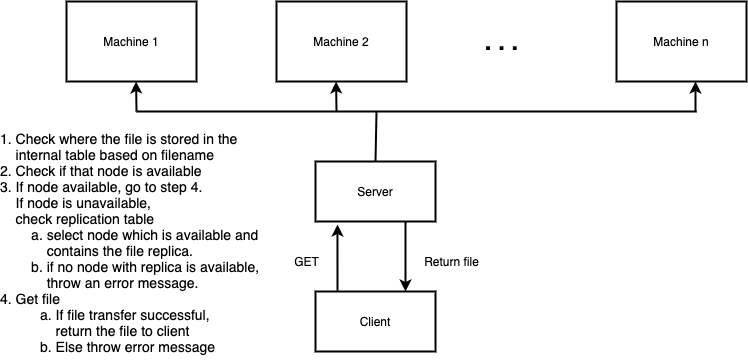

# Distributed File System Exercise

Build a simple functioning distributed file system

## Design decisions

Cases covered:
 - PUT
 - GET
 - Verify file integrity — md5 checksum
 - Dynamic adding of storage nodes
 - Replication of file
 - If store operation not successful, retry based on error code
 - While retrieving, if the primary node is unavailable, fetch from replica 
 - Multiple simultaneous requests to get/put

Cases not covered:
 - Single server — no load balancing
 - No periodic heartbeat check for the storage  - machines
 - No ACL for the files
 - No proper storage distribution
 - Blocking operation for the client
 - No support for multiple files with the same name.     
  If such a request comes, the file is stored with a different unique name and the generated new name is notified to the client.
 - No support for delete operation (could be added  - easily though)

```
Primary node selection algorithm:   Random
Client server protocol:             HTTP
```

## Trade offs made

1. Responsibility to get file from storage node — thick client vs thin client       
    ```
    * Chosen:       thin client
    * Motivation:   ability to modify the business logic without touching the client
    * Cons:         one extra file transfer
    ```

1. Replication responsibility — server vs primary storage node vs dedicated node for replication
    ```
    * Chosen:       dedicated node for replication
    * Motivation:   no extra load on server and primary nodes + async
    * Cons:         eventual replication instead of immediate
    ```

1. Selection of primary node while storing file — based on hash vs random
    ```
    * Chosen:       random
    * Motivation:   ability to add new storage nodes without handling rebalance
   	* Cons:         additional step at retrieval compared to hash based approach
    ```

## Design

### 1. Put a file




### 2. Get a file




## Technology stack

```
Language:               python
Server:                 Flask
DB:                     sqlite3
Task queue:             Celery
Message broker:         Redis
Cluster management:     docker-compose
```

----------------------------
## Requirements

- `python`
- `docker`, `docker-compose`

## Setup

```
$ git clone https://github.com/DevipriyaSarkar/distributed_file_system_sample.git

$ cd distributed_file_system_sample

$ virtualenv --python=python3 ~/PythonEnvs/distributed_file_system_sample

$ source ~/PythonEnvs/distributed_file_system_sample/bin/activate

(distributed_file_system_sample) $ python one_time_setup.py
Created database dfs.db.
Table created for master node.
Table created for storing replication data.
Setup done!

$ docker-compose up -d

# verify whether all the containers are up and running
$ docker ps
CONTAINER ID        IMAGE                                       COMMAND                  CREATED             STATUS              PORTS                    NAMES
de17bdc9ad3e        distributed_file_system_sample_sn3          "/bin/sh -c 'flask r…"   21 hours ago        Up 4 hours          0.0.0.0:6050->6050/tcp   sn3
40d3f9d18281        distributed_file_system_sample_sn0          "/bin/sh -c 'flask r…"   21 hours ago        Up 4 hours          0.0.0.0:5000->5000/tcp   sn0
af9201ea6b44        redis:5-alpine                              "docker-entrypoint.s…"   21 hours ago        Up 4 hours          0.0.0.0:6379->6379/tcp   redis
4d4001d234d4        distributed_file_system_sample_dfs_celery   "/bin/sh -c 'celery …"   21 hours ago        Up 4 hours                                   dfs_celery
54fe337a616b        distributed_file_system_sample_sn1          "/bin/sh -c 'flask r…"   21 hours ago        Up 4 hours          0.0.0.0:5050->5050/tcp   sn1
efd85b121822        distributed_file_system_sample_master       "/bin/sh -c 'flask r…"   21 hours ago        Up 4 hours          0.0.0.0:8820->8820/tcp   master
0f7ed8810411        distributed_file_system_sample_sn4          "/bin/sh -c 'flask r…"   21 hours ago        Up 4 hours          0.0.0.0:7000->7000/tcp   sn4
777586996a22        distributed_file_system_sample_sn2          "/bin/sh -c 'flask r…"   21 hours ago        Up 4 hours          0.0.0.0:6000->6000/tcp   sn2
```

## Usage

```
# store file
$ python client.py put dummy.txt
Initiating store dummy.txt to server.
File stored successfully!
{'message': 'File storage_sn1_5050/dummy.txt saved successfully.',
 'status_code': 200}

# retrieve file
$ python client.py get dummy.txt
Initiating retrive dummy.txt from server.
File retrieved successfully!
Checking file integrity.
{'message': 'received_files/dummy.txt received. File integrity validated.',
 'status_code': 200}
# received files are stored at $PROJECT_ROOT/received_files

# to check where the replicas are
$ docker logs dfs_celery    # or check the db table `replication_data`
[2020-04-14 14:00:09,985: INFO/ForkPoolWorker-8] Task dfs_tasks.replicate[7d5fa969-d85b-4f28-80ad-efdd55898d16] succeeded in 0.04845419999946898s: 'Successful. dummy.txt : sn1:5050 —> sn4:7000'
[2020-04-14 14:00:10,001: INFO/ForkPoolWorker-1] Task dfs_tasks.replicate[a364a055-7f43-47da-b3a8-b20699f62bb8] succeeded in 0.06273929999952088s: 'Successful. dummy.txt : sn1:5050 —> sn0:5000'

# so the file is stored primarily on sn1
# the replicas are there at sn4 and sn0
# can be verified by checking the following directories for dummy.txt
# - $PROJECT_ROOT/storage_sn1_5050
# - $PROJECT_ROOT/storage_sn4_7000
# - $PROJECT_ROOT/storage_sn0_5000
# this is possible without ssh-ing into the individual containers
# because the $PROJECT_ROOT is volumed mounted for ease in
# debugging
```